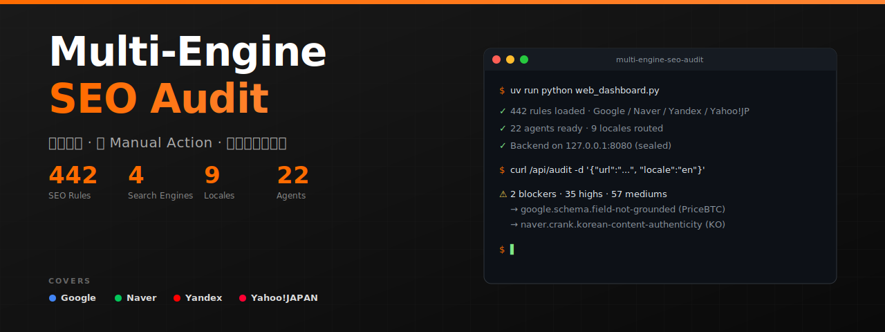

# Multi-Engine SEO Audit

**面向加密交易所与金融 YMYL 站点的企业级深度 SEO 审计平台。** 22 个 Agent 并行驱动，覆盖 442 条规则，横跨 Google Spam Policy 2024、Naver C-Rank、Yandex MatrixNet、Yahoo!JAPAN——产出可证伪、有原始来源的优先级行动清单。一个二进制同时提供 **Web Dashboard** 和**桌面 Electron App**，技术 / 非技术同事都能直接用。

[](https://github.com/SEO-SKILL/multi-engine-seo-audit/actions/workflows/ci.yml)
[](https://www.python.org/)
[](https://www.electronjs.org/)
[](LICENSE)
[](rules/)
[](#平台覆盖)
[](agents/)

> **一个二进制，两种使用方式。**
> - 🌐 **Web Dashboard** — `uv run python web_dashboard.py` → 浏览器打开 `localhost:8080`。适合开发迭代 + 自定义批量审计。
> - 🖥️ **Electron 桌面 App** — `npm run build:mac` → 把 `.dmg` 拖到 `Applications`。适合非技术同事一键审计。

### 为什么是 Multi-Engine SEO Audit

- **防 Google Manual Action**。Spam Policy 2024（site reputation abuse / scaled AI content / expired domain abuse）、EEAT 信号缺口检测、HCU 有用内容信号——全部在页面上线**之前**用硬规则拦截，不用事后写 reconsideration request。
- **不只优化 Google**。Naver 占韩国搜索 60%+、Yandex 占俄罗斯 65%+、Yahoo!JAPAN 占日本 30%+——它们的算法跟 Google 完全不同。本工具内置 C-Rank / MatrixNet / JFSA 披露等平台原生规则，按 locale 自动路由，不浪费审计周期在错误平台。
- **可证伪，不空话**。每条 finding 都附带触发的 detector 函数名、原始 evidence 片段、推荐修复方案、验证命令。没有「improve EEAT」这种废话——只有工程师今天就能 apply 的精确 diff 和 grep 模式。
- **为加密 / YMYL 而生**。预置 SEC / MiCA / JFSA / FSC 违禁词、风险披露要求、区域限制检测、schema spam（用 Review 字段堆价格描述）、寄生 SEO 子路径分类等合规规则。

### 真实数据

8 页核心页面实测：

```
阶段                       平均分    blockers   广播误报
────────────────────────  ───────  ──────────  ──────────────────────
applies_to 过滤前           14.3     8/8        naver 规则误触发到 en/ja/ru 页
P0 收敛后                   37.2     2/8        只剩真问题
P1 收敛后                   38.9     1/8        只剩 1 个真问题（locale 内容质量缺陷）
```

**精度提升 +184%**。8 页中 6 页通过守门员审核，唯一剩下的 blocker 是真问题（KO 首页缺真韩文内容）。

## 谁适合用

- **加密 / 金融科技 / 出版 / 电商类公司的内部 SEO 负责人**。捕获 GSC + Lighthouse 漏掉的：schema 弃用（FAQ 富结果 2026-05）、UGC 子路径被识别为寄生 SEO、过期域名遗产风险、AI 可引用性缺失。
- **DevOps + 合规团队**。Pre-merge 阻断 Manual Action 风险。违禁词检测带 anti-scam 语境守卫（反诈教育文章里出现的"Risk-free returns is a red flag"不会误报）。
- **多市场增长团队**。一个工具覆盖 en / ko / ja / ru / vi / tr / pt / es / zh-CN——根据 locale 自动路由到对应的主搜索引擎，不会用 Google 思路硬套 Naver-first 市场。

## 快速开始

### 前置环境
```bash
brew install python@3.12 uv node
```

### 方式 A · Web Dashboard（开发迭代推荐）
```bash
git clone https://github.com/SEO-SKILL/multi-engine-seo-audit.git
cd multi-engine-seo-audit
uv sync
cp .env.example .env                # 填 ANTHROPIC_API_KEY / GOOGLE_AI_API_KEY
uv run python web_dashboard.py      # → http://localhost:8080
```

### 方式 B · Electron 桌面 App（推荐给同事一键用）
```bash
cd electron-app
npm install
npm run dev                         # 开发模式：自动 spawn Flask + 打开窗口
npm run build:mac                   # → dist/*.dmg（arm64 + x64 双架构）
```

### 方式 C · CLI 单页审计
```bash
curl -X POST http://localhost:8080/api/audit \
  -H "Content-Type: application/json" \
  -d '{"url":"https://example.com/en", "locale":"en", "no_cache":true}'
```

## 平台覆盖

| 引擎 | 市场份额 | 核心算法 | Locale 路由 |
|--------|:------------:|----------------|:---------------:|
| 🔵 Google | 全球 | EEAT · HCU · Spam Policy 2024 · 核心更新 | `en` `zh-CN` `vi` `tr` `pt` `es` |
| 🟢 Naver | 🇰🇷 60%+ | C-Rank · D.I.A · 韩文真实性 | `ko` |
| 🔴 Yandex | 🇷🇺 65%+ | MatrixNet · Minusinsk · Madrid · AGS · Metrica | `ru` |
| 🟡 Yahoo!JAPAN | 🇯🇵 30%+ | Chiebukuro · JFSA 披露 | `ja` |

## 功能特性

### 442 条规则 · 8 大维度
- **EEAT 信号**（13 条）— 作者署名、Organization schema、YMYL 信号完整性
- **结构化数据**（15 条）— JSON-LD 语法、弃用 type（FAQ/HowTo）、字段可见性 grounding
- **Manual Action**（17 条）— cloaking、隐藏文本、被黑入侵模式、付费外链
- **Spam Policy 2024**（4 条）— 站点声誉滥用、AI 规模化内容、过期域名滥用
- **多引擎原生**— Naver C-Rank（6）、Yandex（8）、Yahoo!JAPAN（3）
- **合规**（9 条）— 违禁词 + 反诈语境守卫、风险披露、区域限制、YMYL EEAT
- 完整规则清单：[`rules/`](rules/)

### 并行 Agent 扇出
```
crawler-agent（多 UA + WAF retry + 限流）
    │
    ├──> technical-agent（canonical / hreflang / schema / EEAT / 隐藏 / 质量 / web-vitals）
    ├──> safety-agent（违禁词 / pros-ticker）
    ├──> geo-agent（AI Overviews / Discover / LLM 引用）
    ├──> lifecycle-agent（freshness / pruning / dia）
    ├──> localization-agent（Naver / Yandex / Yahoo!JP / Bing per-locale）
    │
    ▼
semantic-agent（LLM judge：抄袭 / 真实性 / EEAT 深度）
    │
    ▼
report-agent（综合评分 · 行动清单 · markdown 导出）
```

### UI / UX 细节
- **Hero 一句话结论** — 一眼看「可上线 / 暂不上线 / 改后再审」+ 8 维雷达
- **守门员 vs 优化双区** — Blocker 规则阻塞上线，Medium-Low 按 ROI 排序成优化建议
- **中文规则标签** — `google.spam-2024.site-reputation-abuse` 自动渲染为「Google · 垃圾内容政策2024 / 站点声誉滥用（寄生 SEO）」
- **一键导出 Markdown** — 单页或 batch 汇总两种报告格式，可粘贴飞书 / Notion / GitHub Issue

### 安全默认
- 后端只绑 `127.0.0.1` — 不暴露局域网或公网
- `applies_to.platforms` + `applies_to.locales` 严格过滤 — 规则不会跨引擎误触发
- API key 只存本地 `.env`（gitignore 屏蔽，不上传任何服务器）
- 反诈语境守卫防止违禁词在教育性内容上误报
- First-party 路径白名单防止 UGC 被误判为寄生 SEO

## 架构

```
┌──────────────────────────────────────────────────────────────┐
│           Electron 桌面 App（Mac · Win）                     │
│  ┌────────────────────────────────────────────────────────┐  │
│  │ Main 进程：spawn Flask + IPC + 生命周期 + 菜单         │  │
│  └────────────┬───────────────────────────────────────────┘  │
│               ▼                                              │
│  ┌────────────────────────────────────────────────────────┐  │
│  │ BrowserWindow → http://127.0.0.1:8080                  │  │
│  └────────────────────────────────────────────────────────┘  │
└────────────────────────────────────────────────────────────────┘
                  │ child_process.spawn
                  ▼
┌──────────────────────────────────────────────────────────────┐
│       Flask 后端 · 127.0.0.1 only（封闭）                    │
│                                                              │
│   Orchestrator（locale → active_platforms 路由）             │
│        │                                                     │
│        ├─► 22 个 agent 并行（asyncio.gather）                │
│        │                                                     │
│        ├─► 通用 detector runner                              │
│        │     - applies_to 过滤                               │
│        │     - 442 条 yaml 规则 → detector 函数分发          │
│        │                                                     │
│        └─► LLM judge（Anthropic 主 + Gemini 兜底）           │
│                                                              │
│   综合评分 · 行动清单 · Markdown 导出                        │
└──────────────────────────────────────────────────────────────┘
```

## 文档导览

| 文档 | 用途 |
|------|---------|
| [SKILL.md](SKILL.md) | 完整能力矩阵（命令 · agent · 规则） |
| [PRD.md](PRD.md) | 产品需求文档 |
| [EXECUTIVE_SUMMARY.md](EXECUTIVE_SUMMARY.md) | 高管摘要 |
| [V2_MILESTONE_REPORT.md](V2_MILESTONE_REPORT.md) | v2 里程碑交付 |
| [GOOGLE_RANKING_COVERAGE.md](GOOGLE_RANKING_COVERAGE.md) | Google 排名因素覆盖矩阵 |
| [PLATFORM_REMEDIATION_PLAN.md](PLATFORM_REMEDIATION_PLAN.md) | 内部修复 playbook |
| [WILL_ONBOARDING.md](WILL_ONBOARDING.md) | 新工程师 onboarding |
| [CREDENTIALS_SETUP.md](CREDENTIALS_SETUP.md) | API key 配置指南 |
| [electron-app/README.md](electron-app/README.md) | 桌面 App 构建 + 分发 |

## 路线图

- [x] **v1.0** · 442 规则 · 8 维综合评分 · Web Dashboard
- [x] **v1.1** · locale 智能路由 · Naver / Yandex / Yahoo!JP 原生规则
- [x] **v2.0** · 守门员 vs 优化双模式 · Electron 桌面化 · 防 manual action 模式复发
- [ ] **v2.1** · 内嵌 Python runtime（同事免装 uv）
- [ ] **v2.2** · macOS 代码签名 + 公证（去 Gatekeeper 警告）
- [ ] **v2.3** · 自动更新（electron-updater）
- [ ] **v3.0** · GSC + GA4 历史趋势接入 · 多租户组织模式

## 贡献

仅限内部团队 — 通过 GitHub 提 Issue / PR。

- 新规则放 `rules/{platform}/_rules/*.yaml`（必须含 `applies_to` + `business_impact` + `tags`）
- 新 detector 放 `detectors/*.py`，需配 fixture + `tests/` 下的测试用例
- Merge 前跑 `uv run pytest tests/` 全绿
- LLM judge prompt 放 `prompts/*.md` — 用现有 fixture 跑 snapshot 测试

## 许可

[MIT](LICENSE) — 完整条款见 `LICENSE` 文件。

## 维护者

由内部 SEO 团队维护。问题请提 Issue。

---

<div align="center">
<sub>用 ☕ + Python 3.12 + Flask + Electron 32 + Anthropic Claude 构建 · 2026</sub>
</div>
